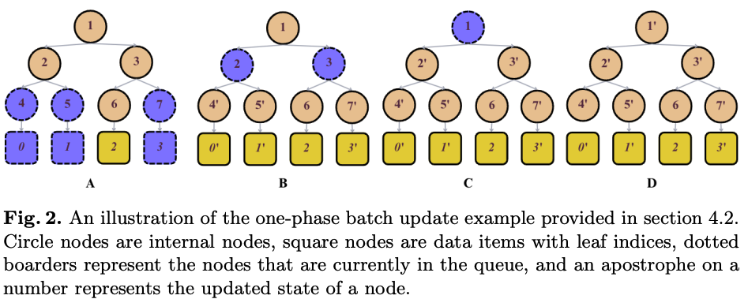
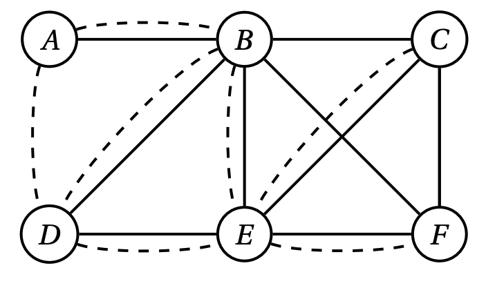

## Hello

G'day, 

Currently, I'm working on [Heffron AI](https://www.heffron.ai/ "Heffron AI"). We build conversational Voice AI for voicemail. Time is money, therefore our mission is to help individuals and businesses to turn missed calls into revenue.

In December 2023, I finished my undergraduate degree with First Honours in computer science at the [University of New South Wales](https://www.unsw.edu.au/) here in Sydney, Australia. While studying, I was supported by the UNSW [Co-op scholarship](https://www.co-op.unsw.edu.au/). I was extremely fortunate to complete my honors thesis on the topic of blockchain scaling algorithms under the advisory of [Dr Sushmita Ruj](https://research.unsw.edu.au/people/dr-sushmita-ruj-0), during which we published my first peer-reviewed paper.

Prior to thesis, I worked with [Dr Jiaojiao Jiang](https://research.unsw.edu.au/people/dr-jiaojiao-jiang) on classifying node importance on multiplex networks, during which we proposed a simple yet effective algorithm to capture a node's local and global importance. Our work was accepted for an oral presentation at [Complex Networks 2023](https://complexnetworks.org/).

Outside of university, I've been working as a software engineer in various teams and places.

<!-- ### Why Blockchain?

Early on in my undergraduate studies, I interests leaned more towards machine learning and data science. In 2021, at the height of the NFT bull market, I experience first hand the poor scalability issue of Ethereum by paying $90 gas fee on a $30 NFT ([view tx here](https://etherscan.io/tx/0x31fc76f46eee32d9ea8142faf1fe30414c04a5e96744dde8e8e96a8ce99290f5)). Overlooking the hype and the FUD during the bull market, I began learning about the fundamentals of blockchain.

Right before it was time to select my thesis topic, I took a blockchain software course ([COMP6452](https://www.handbook.unsw.edu.au/undergraduate/courses/2024/COMP6452?year=2024)) that completely changed my outlook on the potential impact of blockchain technology. I see blockchain as a tool to democratize global finance participation. -->

On the side, I managed (2019-2023) a high school education publisher [Catch Up With Top Achievers](http://Top-Achievers.com.au "Catch Up With Top Achievers"). Our [study guides](https://www.amazon.com.au/s?k=Tree+Niu+Bee+Pty.Ltd&i=digital-text&dc&ref=a9_asc_1 "Study guides") have been consistently ranking first on Amazon under multiple education categories.

## Publications

<table border="1">
    <tr>
        <td class="col1"></td>
        <td class="col2">
            <h3><a href="https://arxiv.org/abs/2310.13328">One-Phase Batch Update on Sparse Merkle Trees for Rollups</a></h3>
            
<em><u>Boqian Ma</u>, Vir Pathak, Lanping Liu, Sushmita Ruj</em>

            
<b>SDLT 2023</b>: Symposium on Distributed Ledger Technology

            
<b>Oral Presentation</b>

            
<a href="https://arxiv.org/pdf/2310.13328.pdf">[PDF]</a> 
            <a href="https://github.com/Boqian-Ma/one-phase-batch-update-SMT">[Code]</a>
            <a href="https://docs.google.com/presentation/d/14RU-vMSlMvcA7amA1L1a-9ZtluWJSRdk01Prj-eezYg/edit?usp=sharing">[Slides]</a>             
            

        </td>
    </tr>
    <tr>
        <td class="col1"></td>
        <td class="col2">
              <h3><a href="https://arxiv.org/abs/2309.07617">Influence Robustness of Nodes in Multiplex Networks against Attacks</a></h3>
              
<em><u>Boqian Ma</u>, Hao Ren, Jiaojiao Jiang</em>

              
<b>Complex Networks 2023</b>: International Conference on Complex Networks and their Applications

              
<b>Oral Presentation</b>

              
<a href="https://arxiv.org/pdf/2309.07617.pdf">[PDF]</a> <a href="https://github.com/Boqian-Ma/MultiCoreRank">[Code]</a>
                          <a href="https://www.youtube.com/watch?v=y7TTTPgHRDY">[Oral]</a>
              

    </td>
    </tr>
</table>

## Work Experience
[Heffron AI](https://www.heffron.ai/ "Heffron AI")
: **Co-Founder / CTO**, March 2024 - Present

[WiseTech Global](https://www.wisetechglobal.com/ "WiseTech Global")
: **Content Service Team**, November 2022 - March 2023 (Left to focus on Honours year research project)
: **NLP Machine Learning Engineer**, September - November 2021
: **C# Back-End Software Engineer**, June - September 2021
: C#, .Net, Python3, Keras, SQL

[Westpac](https://www.westpac.com.au/ "Westpac")
: **Data Discovery Lab**, November 2021 - May - 2022
: Python3, Azure

[Sydney Digital Currency Exchange](https://exchange.sdce.com.au/ "SDCE")
: **Back-End Software Engineer Intern**, November 2020 - February 2021
: Golang, Go-Swagger, MongoDB, Selenium, Python3

[Catch Up With Top Achievers](https://Top-Achievers.com.au/ "Catch Up With Top Achievers")
: **Founder**, 2019 - 2022
： Self-published three high school study guides. Hundreds of schools and libraries in Sydney have it on their book shelves.

## News

- 08/2024: We launched [Heffron.ai](https://heffron.ai/)
- 01/2024: I have officially graduated from UNSW. The best is yet to come.
- 10/2023: Our paper "Influence Robustness of Nodes in Multiplex Networks against Attacks" was accepted for publication and oral presentation at [Complex Networks 2023](https://complexnetworks.org/).
- 09/2023: Our paper "One-Phase Batch Update on Sparse Merkle Trees for Rollups" was accepted for publication at [SDLT23](https://symposium-dlt.org/). This paper spawned from my undergraduate thesis supervised by Dr Sushmita Ruj.
- 09/2022: The UNSW golf team traveled to Perth, Australia to compete in the UniSport Nationals golf tournament. We brought home 15 individual medals and a second-place trophy for the team event.
- 09/2022: I started my honours year at UNSW, my research topic will be scaling the blockchain.
- 12/2021: I joined Westpac Group as a Data Science intern, focusing on writing automated ML model release pipeline.
- 05/2021: I joined WiseTech Global as a Software Engineering intern, building software products to enhance the global supply chain.
- 26/04/2021 I was accepted as a transfer Co-op scholar in Computer Science at UNSW. I started my first work placement in June at WiseTech Global for 24 weeks.

## Media

- Channel 7's Sunday Sunrise - [2020 HSC and Beyond](https://www.youtube.com/watch?v=dv0kiEdhMyc&t=3s) - 13/10/2020
- Phoenix TV South Pacific & Australia - [澳华人后代出书传授高考心得引关注](https://www.youtube.com/watch?v=woUTLiO1TIs) - 07/11/2020
- The Sydney Morning Herald - ['Delete your apps': How to blitz the HSC, by those who did](https://www.smh.com.au/education/delete-your-apps-how-to-blitz-the-hsc-by-those-who-did-20190829-p52m0t.html) - 01/09/2019

## About Me

Outside of work and university, I like to play golf and [basketball](https://www.instagram.com/p/CqcAyGOPRsA/). I am a member at the St. Michael's Golf Club here in Sydney, Australia. My current official [handicap](https://www.golf.org.au/handicap/?golfLinkNo=2012203208) is 11. Occasionally, I enjoy low-stake cash and tournament poker.

## Reading List

### Currently reading

1. [Thinking Fast and Slow by Daniel Kahneman](https://www.penguin.com.au/books/thinking-fast-and-slow-9780141033570)
2. [Naked Money by Charles Wheelan ](https://www.amazon.com/Naked-Money-Revealing-Financial-System/dp/0393353737)

### Recently Finished

1. [Zero to One by Peter Thiel](https://www.penguin.com.au/books/zero-to-one-9780753555200)
2. [Rich Dad Poor Dad by Robert Kiyosaki](https://www.richdad.com/)
3. [12 Rules of Life by Jordan Peterson](https://www.jordanbpeterson.com/12-rules-for-life/)
4. [The Lean Startup by Eric Ries](http://theleanstartup.com/)
5. [Indistractable by Nir Eyal](https://www.nirandfar.com/indistractable/)
   ...
   <!--   -->
   <!--  -->
